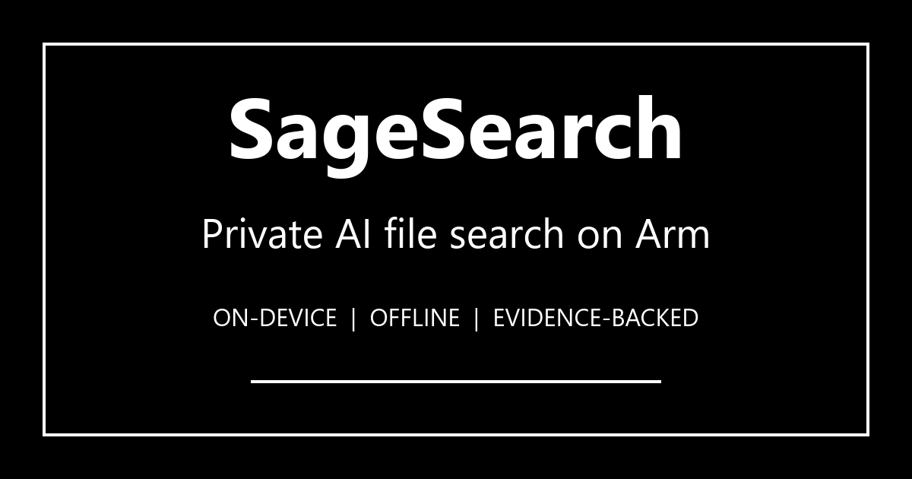
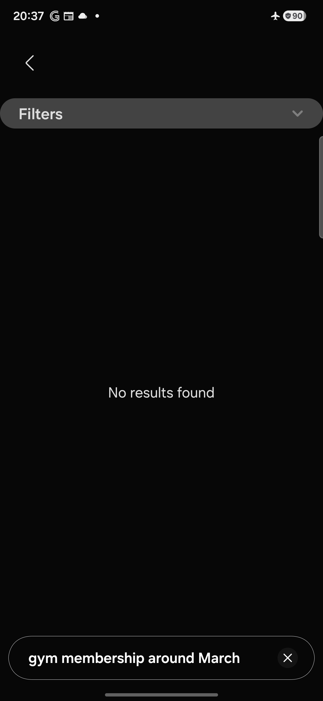

# SageSearch on Arm

[](LICENSE)



> Find local files using plain language. Your file index and results stay on your device.

---

## Arm Create hackathon build: Android offline search

The current hackathon build turns SageSearch into an offline Android file-search
launcher for the **Mobile AI track**. A user approves files or folders, SageSearch
indexes their metadata and bounded OCR locally, and an on-device Gemma 4 E2B
planner converts remembered details into a strictly validated search plan.

Gemma never sees filenames, OCR text, database rows, file URIs, or search
results. Trusted Kotlin code validates the plan and queries a private Room/FTS
index. Deterministic preliminary results stay available while the model runs or
if inference fails.

### The demo difference

The same phrase, `gym membership around March`, was tested in airplane mode on
a Samsung Galaxy A57. Samsung My Files 15.4.09.5 returned no result. SageSearch
matched the camera-named synthetic receipt `IMG_20260312_184522.png`, showed
stored match evidence, and opened the original.

| Native filename search | SageSearch local intent search |
|---|---|
|  |  |

The controlled comparison uses one device and one synthetic fixture. It is not
a universal claim about every Android file manager or private document corpus.

### What changed for Arm

Before the challenge, SageSearch was a Windows/LM Studio proof of concept and
the Android folder contained a single-image OCR prototype. The challenge-period
contribution is the complete offline Android search system and Arm evidence in
this section:

- Replaced desktop LM Studio dependency with reusable on-device LiteRT-LM 0.16.0
  inference on an `arm64-v8a` phone.
- Reduced Gemma's job to a compact constrained query-planning contract instead
  of RAG over private documents.
- Added native JSON-schema-constrained decoding, strict validation,
  deterministic reconciliation, and exact-first local ranking.
- Serialized expensive OCR and inference work while giving interactive search
  priority.
- Added resumable WorkManager indexing, bounded image/PDF OCR, Room FTS4, and a
  200-candidate retrieval cap.
- Measured backend, prompt, output-control, quality, latency, memory, battery,
  and thermal behavior on the target Arm device.

### Measured A57 evidence

Model: Gemma 4 E2B LiteRT-LM container, 2,588,147,712 bytes, SHA-256
`181938105e0eefd105961417e8da75903eacda102c4fce9ce90f50b97139a63c`.
The matrix uses 20 public synthetic planner cases.

| Configuration | Schema valid | Plan F1 | Median | p95 | Result |
|---|---:|---:|---:|---:|---|
| GPU baseline, unconstrained | 0% | 0.000 | unavailable | unavailable | 20/20 generation calls failed with `LiteRtLmJniException` |
| CPU baseline, unconstrained | 0% | 0.000 | 8.009 s | 12.810 s | Failed quality gate |
| CPU optimized, unconstrained | 100% | 0.636 | 4.617 s | 8.463 s | Failed quality gate |
| CPU optimized, constrained hybrid | 100% | 1.000 | 8.766 s | 11.820 s | Production default |

GPU generation did not produce a comparable passing baseline, so GPU speedup is
**not measurable** and this project makes no GPU, NPU, SME2, i8mm, KleidiAI,
battery-life, or energy-efficiency claim.

The separate on-device Room/FTS smoke benchmark seeded 10,000 synthetic
documents. After three warmups, 25 recorded runs measured **8.971 ms p50** and
**12.069 ms p95**, with the intended document ranked first for all three fixed
queries. This timing excludes OCR, Gemma inference, and UI rendering.

Raw and summarized evidence:

- [42-second captioned demo draft](artifacts/demo/SageSearch-Arm-Create-demo-draft.mp4)
- [`results/task11/a57/summary/comparison.md`](results/task11/a57/summary/comparison.md)
- [`results/task11/a57/summary/comparison.json`](results/task11/a57/summary/comparison.json)
- [`results/task11/a57/demo-rehearsal.json`](results/task11/a57/demo-rehearsal.json)
- [`benchmark/search-planner/README.md`](benchmark/search-planner/README.md)

### Fast judge path

Requirements: an Arm64 Android device running Android 7.0/API 24 or newer, a
compatible Gemma 4 E2B `.litertlm` file obtained separately, and USB debugging
for APK installation.

1. Build or install `android/app/build/outputs/apk/debug/app-debug.apk`.
2. Launch SageSearch and approve a folder or individual files through Android's
   system picker.
3. Choose the compatible `.litertlm` model under **Prepare AI model**. The app
   copies it to backup-excluded private storage, calculates its hash, and only
   shows **Ready** after LiteRT-LM initialization succeeds.
4. Wait for local indexing to finish, then tap **Search indexed files**.
5. Turn on airplane mode and search `gym membership around March` against
   [`artifacts/demo/IMG_20260312_184522.png`](artifacts/demo/IMG_20260312_184522.png).
6. Inspect the factual match fields, tap **Open file**, add another remembered
   detail to strengthen the same search, then tap **New search** to reset.

### Build and verify

Use Android Studio's JDK 17 and Android SDK 36:

```powershell
cd android
.\gradlew.bat testDebugUnitTest lintDebug assembleDebug assembleDebugAndroidTest
```

Install on an authorized device:

```powershell
adb install -r app/build/outputs/apk/debug/app-debug.apk
```

Regenerate the checked-in comparison after capturing the fixed matrix:

```powershell
python benchmark/search-planner/build_task11_report.py `
  --cases benchmark/search-planner/cases.jsonl `
  --result-root results/task11/a57/matrix `
  --retrieval results/task11/a57/preliminary-search.json `
  --output-dir results/task11/a57/summary
```

Final local verification: 74 Android JVM tests, 9 Python evaluator/report tests,
Android lint, debug assembly, APK install, and the A57
10,000-document instrumented benchmark. Debug APK SHA-256:
`02B5E99E79BDC359F8DE94B8B7DB4BEBBBE9B97ACB9EA79238900EEFE3AE3068`.

### Known limitations

- The APK does not bundle or redistribute the 2.6 GB Gemma model; the user must
  obtain and select a compatible container separately.
- Planner evaluation uses a 20-case synthetic smoke set, not broad production
  accuracy testing.
- End-to-end planning takes several seconds on the tested A57; fast local
  preliminary retrieval keeps the search experience usable during refinement.
- Only the Samsung Galaxy A57 configuration is claimed. No A05, GPU-speedup,
  energy, or battery-life result is presented.
- Android Storage Access Framework restrictions mean users must explicitly
  approve accessible folders or individual files.

The source code is licensed under [Apache License 2.0](LICENSE). Third-party
models and dependencies remain under their own licenses and terms. The Gemma
model file is not included in this repository.
